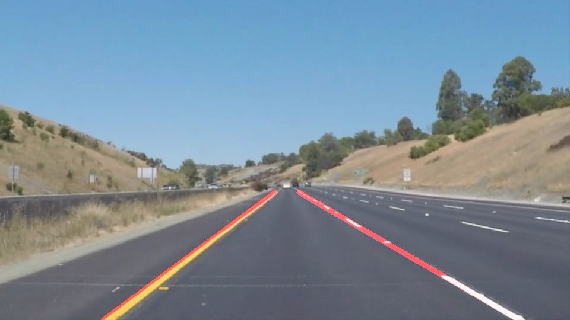

# **Finding Lane Lines on the Road** 

### 1. Describe your pipeline. As part of the description, explain how you modified the draw_lines() function.

My pipeline consisted of the following steps:
1. Convert images from RGB to grayscale.
2. Apply a Gaussian kernel of size 5 to smooth the grayscale image.
3. Use the Canny edge detection algorithm with low and high thresholds of 75 and 150, respectively, to extract the edges from the image.
4. Use a quadrilateral region of interest mask to isolate the area of the image of edges where the lane markings are expected to be.
5. Use a Hough transform to connect the edges with lines. These lines mark the lane lines.
6. Overlay the calculated lane lines from the Hough transform with the original image.

In order to draw a single line on the left and right lanes, I averaged the X and Y coordinates of the beginning and and of the left and right lane lines to reduce the number of lines to two, one per side. I distinguished between left and right lines using the sign of the slope of each line.

Below is an example of the output of the pipeline on a single image:

### 2. Identify potential shortcomings with your current pipeline

One potential shortcoming would be what would happen when the car is turning in such a way that the slopes of the left and right lane lines have the same sign. In this case, the left and right lanes cannot be distinguished by slope, so there will likely be one lane line somewhere in the middle of the lane after averaging.

Another shortcoming could be that if the lanes are wide, the region of interest may be too narrow for the lane markings to fit inside.

### 3. Suggest possible improvements to your pipeline

A possible improvement would be to tune the parameters of the Gaussian smoothing, Canny edge detection, region of interest, and/or the Hough transform to better isolate the lane lines from the rest of the image.

Another potential improvement could be to model the lines as quadratic functions instead of linear functions to account for curvature of the road during turning.
